# 03. Architecture

## Overview
TradeEvidence will be built as a modular product experience with a clear separation between a public website and an authenticated trading application.

## Core Product Domain

The product experience is organized around the user's journey from identity and profile to decision-making and learning.

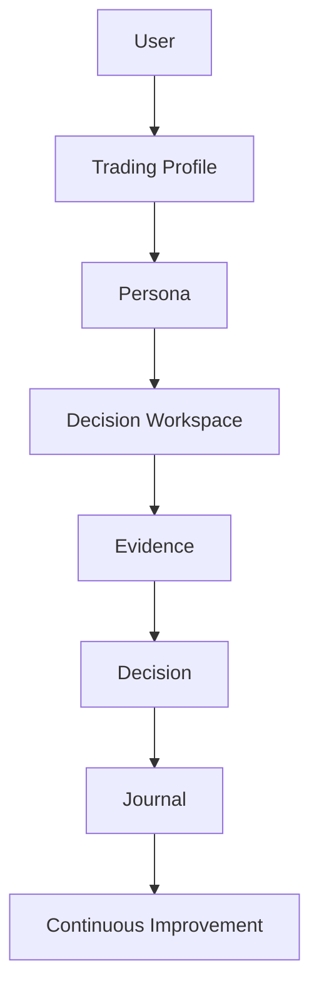

The Decision Workspace becomes the primary surface for market context, evidence review, risk framing, and post-decision reflection. The trading profile and persona inform personalization, while the journal and continuous improvement loop help the trader develop judgment over time.

## High-level Architecture

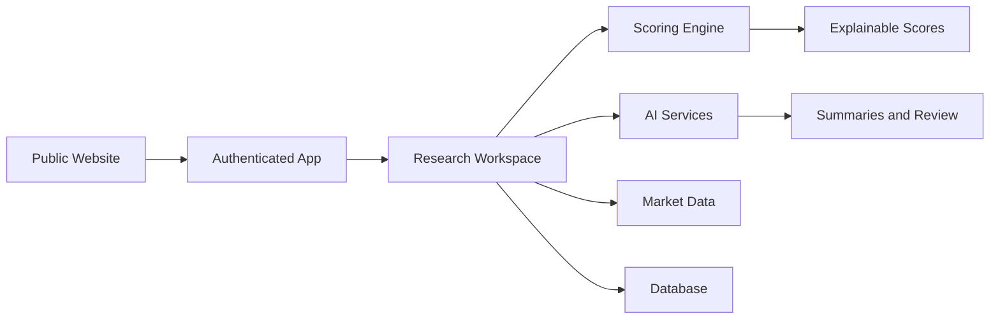

## Frontend
The user-facing experience will be built with:
- Next.js
- React
- TypeScript
- Tailwind CSS

The frontend will support:
- desktop-first trading workflows
- responsive layouts for broader access
- modular dashboard and workspace surfaces
- light, dark, and system theme support

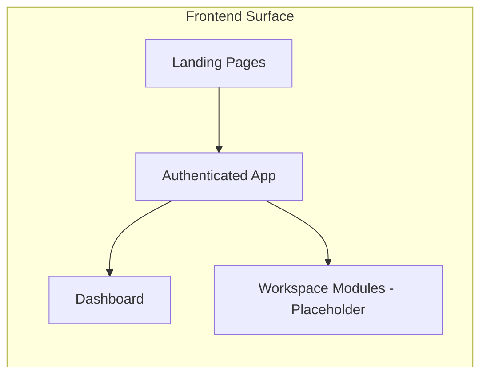

## Backend (Future)
A backend layer will be introduced when the product requires authenticated services, persistent analysis workflows, and data synchronization.

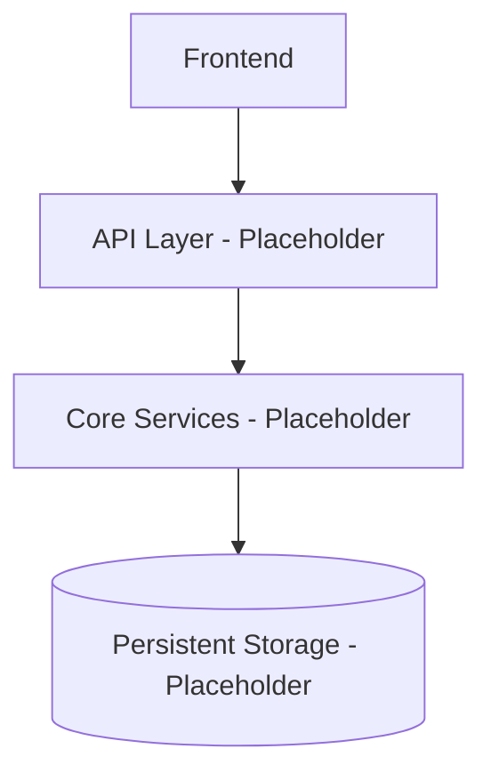

## Authentication
Authentication will support secure access to the authenticated application and protect personal workspaces, journals, and saved analysis.

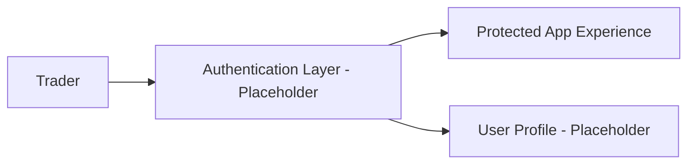

## Market Data
Market data services will provide the context required for:
- watchlists
- sector views
- scanners
- market summaries
- score inputs

## Scoring Engine
The scoring engine will combine multiple evidence categories into explainable scores. It will remain transparent and non-black-box in nature.

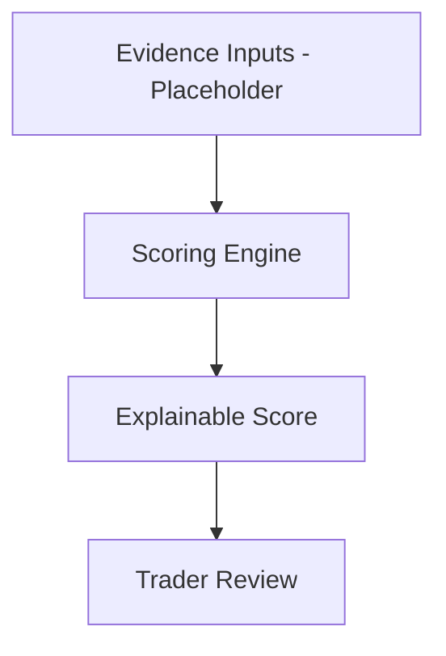

## Evidence History and Validation
TradeEvidence should treat evidence as a durable asset rather than a transient calculation. Each scoring run should produce an immutable Evidence Snapshot that captures the market context, the evidence used, the model version, the data version, and the later outcome. This supports historical validation and enables the platform to learn from its own past assessments without overwriting earlier beliefs.

The architecture should therefore preserve:
- an Evidence History Repository for persisted snapshots and review trails
- model versioning and data versioning for every score and analysis run
- outcome measurements that compare earlier expectations with what later occurred
- a Devil's Advocate perspective that preserves both supporting and contradicting evidence
- a Future Evidence Lab for retrospective analysis and product learning

This pattern is described in more detail in [Evidence-History-and-Validation.md](Evidence-History-and-Validation.md) and the expected record structure is defined in [Evidence-Snapshot-Data-Contract.md](Evidence-Snapshot-Data-Contract.md).

## AI Services
AI services may be used for:
- explaining scores
- summarizing evidence
- reviewing journals
- generating reports
- supporting educational assistance

AI should support trader decisions without replacing them.

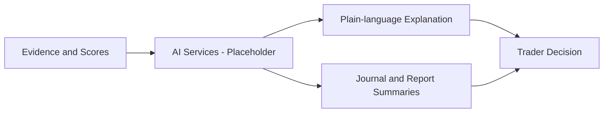

## Database
A persistent data store will be needed for user content, saved analyses, journals, alerts, portfolios, and market context.

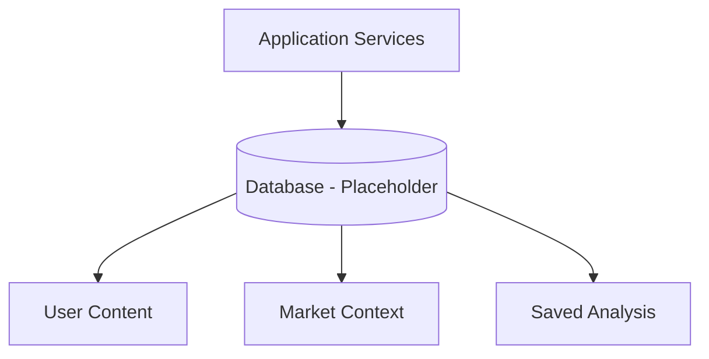

## Deployment
The product will use:
- GitHub for source control and collaboration
- Vercel for deployment and hosting

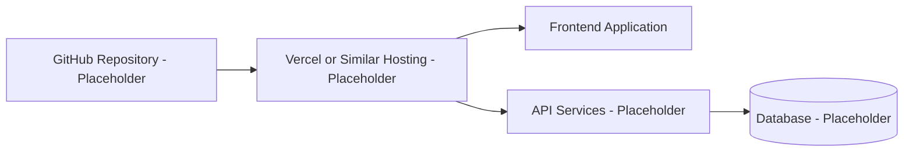

## GitHub
GitHub will serve as the collaboration and source-control layer for the product.

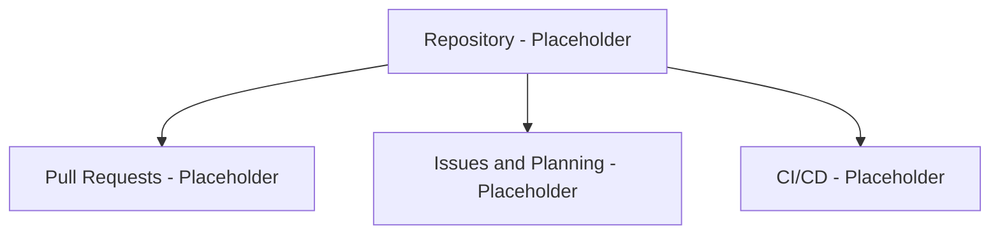

## Vercel
Vercel will be considered for hosting and deployment once the initial application and deployment workflow are defined.

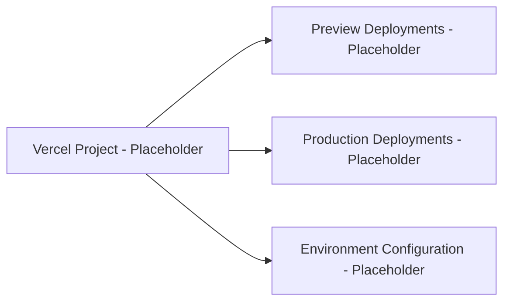

## Future Cloud Architecture
As the platform grows, the architecture may evolve to include:
- managed application hosting
- API services for market and scoring data
- asynchronous background processing for alerts and reports
- observability and analytics

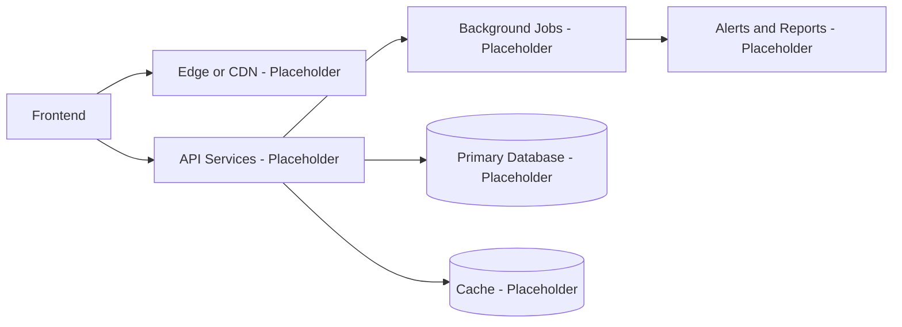

## Request Flow

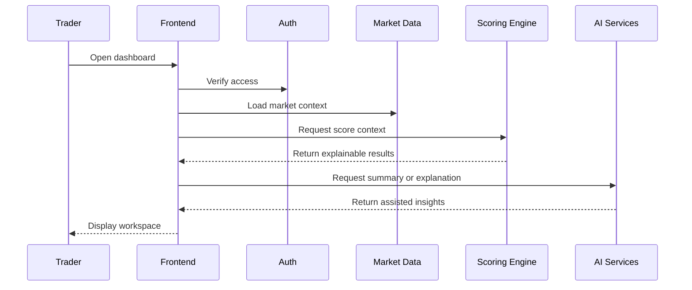

## Deployment Concept

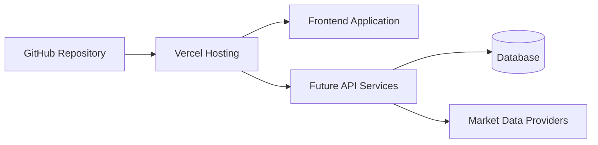

---

## TODO

### High
- Define the initial backend service boundaries for the first production-ready release.
- Clarify the authentication provider and account model assumptions.
- Decide the storage strategy for user content, market context, and saved analysis.

### Medium
- Document the expected interaction between the frontend, scoring services, and AI-assisted review flows.
- Clarify whether the first release needs asynchronous processing for reports or alerts.

### Low
- Add a more detailed deployment diagram once hosting and operational responsibilities are finalized.

## Related Documents
- [00-PRD.md](00-PRD.md)
- [01a-Product-Philosophy.md](01a-Product-Philosophy.md)
- [04-Design-System.md](04-Design-System.md)
- [05-Product-Decisions.md](05-Product-Decisions.md)
- [06-Roadmap.md](06-Roadmap.md)
- [07-Decision-Workspace-Concept.md](07-Decision-Workspace-Concept.md)
- [08-AI-Strategy.md](08-AI-Strategy.md)
- [09-Data-Model.md](09-Data-Model.md)
- [Trading-Profile.md](Trading-Profile.md)
