# 06. Roadmap

## Release Overview
The roadmap below outlines the intended evolution of TradeEvidence from early foundation work to a production-ready platform.

| Release | Focus |
| --- | --- |
| v0.1 | Landing Page |
| v0.2 | Authentication |
| v0.3 | Dashboard |
| v0.4 | Scoring Engine |
| v0.5 | Watchlists |
| v0.6 | AI Review |
| v0.7 | Journal |
| v0.8 | Portfolio |
| v0.9 | Reports |
| v1.0 | Production Release |

## Release Flow

```mermaid
flowchart LR
    A[v0.1 Landing Page] --> B[v0.2 Authentication]
    B --> C[v0.3 Dashboard]
    C --> D[v0.4 Scoring Engine]
    D --> E[v0.5 Watchlists]
    E --> F[v0.6 AI Review]
    F --> G[v0.7 Journal]
    G --> H[v0.8 Portfolio]
    H --> I[v0.9 Reports]
    I --> J[v1.0 Production Release]
```

## Release Notes

### Engineering Architecture Phase (Approved Plan)
- Master System Architecture
- MVP Implementation Specification
- MVP Data Schema
- API Contracts
- Frontend and Backend Architecture
- Evidence Engine and AI Workflow
- Delivery Readiness
- First Vertical Slice

This phase defines implementation-ready engineering artifacts before full feature acceleration. It does not replace product philosophy or alter approved product AI behavior boundaries.

Traceability Update (2026-07-18): Workshop #1 is completed with approved baseline artifacts: [engineering/Master-System-Architecture.md](engineering/Master-System-Architecture.md), [engineering/Canonical-Analytical-Model.md](engineering/Canonical-Analytical-Model.md), and [governance/decisions/ADR-002-Master-System-Architecture.md](governance/decisions/ADR-002-Master-System-Architecture.md).

Traceability Update (2026-07-19): Workshop #2 is completed with the approved [MVP Implementation Specification](engineering/MVP-Implementation-Spec.md), [Workshop #2 Summary](workshops/Workshop-02-Summary.md), and [ADR-004](governance/decisions/ADR-004-Canonical-Market-Observations-and-Retention.md). Workshop #3 is the MVP Data Schema.

### v0.1 — Landing Page
- establish the public website experience
- communicate the product vision and value proposition
- introduce the evidence-based positioning

### v0.2 — Authentication
- support secure access to the authenticated experience
- define the initial user account and profile flow

### v0.3 — Dashboard
- deliver the first trading workspace experience
- introduce the primary dashboard layout inspired by product mockups

### v0.4 — Scoring Engine
- build the initial explainable scoring framework
- define scoring categories and evidence inputs

### v0.5 — Watchlists
- support organization of tracked assets and market context
- expose watchlist-specific analysis views

### v0.6 — AI Review
- introduce AI-assisted summaries and review support
- maintain a clear role for AI features as decision support rather than decision authority

### v0.7 — Journal
- enable structured journaling of observations and outcomes
- support reflection on assumptions and decision quality

### v0.8 — Portfolio
- provide portfolio-oriented context and performance review
- connect journal and analysis workflows

### v0.9 — Reports
- produce reports that summarize evidence, scores, and reflections
- support better review and learning cycles

### v1.0 — Production Release
- stabilize the product experience
- support light, dark, and system themes
- deliver a reliable foundation for future growth

---

## TODO

### High
- Sequence milestone dependencies more explicitly for the first release path.
- Define acceptance criteria for each release milestone.

### Medium
- Clarify which features should be included in v0.4 and v0.5 based on initial product scope.
- Document any release ordering changes if the initial architecture decisions shift.

### Low
- Add release notes for future milestones once they are finalized.

## Related Documents
- [00-PRD.md](00-PRD.md)
- [03-Architecture.md](03-Architecture.md)
- [05-Product-Decisions.md](05-Product-Decisions.md)
- [07-Scoring-Engine.md](07-Scoring-Engine.md)
