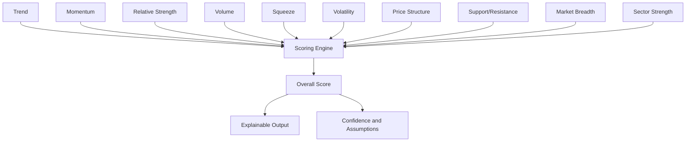

# 07. Scoring Engine

## Purpose
The scoring engine is the analytical core of TradeEvidence. It helps users evaluate market opportunities using multiple evidence sources and explainable criteria.

## Scoring Philosophy
Scores should be generated from multiple independent evidence sources rather than a single opaque signal. Each score should be understandable, traceable, and useful for decision support.

## Design Principles
- explain every score
- show the evidence behind the score
- separate signal strength from confidence
- make assumptions visible
- avoid black-box scoring

## Example Score Categories

| Category | Purpose |
| --- | --- |
| Trend | Evaluate the direction and strength of price movement. |
| Momentum | Measure the pace of recent price movement. |
| Relative Strength | Compare an asset's strength against peers or benchmarks. |
| Volume | Assess participation and conviction. |
| Squeeze | Identify periods of compressed volatility that may precede expansion. |
| Volatility | Understand the risk and variability of the setup. |
| Price Structure | Review chart structure and notable levels. |
| Support/Resistance | Identify key levels that may shape behavior. |
| Market Breadth | Understand the broader market environment. |
| Sector Strength | Evaluate whether the sector is helping or hurting the opportunity. |

## Scoring Approach
A score should be treated as a structured summary of evidence, not a decision directive. It should support a trader's own analysis by clarifying:
- what evidence is present
- which factors are contributing positively or negatively
- where confidence is high or uncertain

## Evidence-to-Score Flow

## Output Expectations
The scoring engine should provide:
- a clear score or rating
- supporting evidence
- visible assumptions
- contextual notes on uncertainty
- a narrative explanation when needed

---

## TODO

### High
- Define the initial scoring model and weighting approach for v0.4.
- Define how scores should be visualized and compared in primary product views.

### Medium
- Clarify how confidence and assumptions should appear beside each score.
- Document how evidence categories should be grouped or prioritized in the first release.

### Low
- Capture any score model updates that emerge from early testing or user feedback.

## Related Documents
- [03-Architecture.md](03-Architecture.md)
- [08-AI-Strategy.md](08-AI-Strategy.md)
- [09-Data-Model.md](09-Data-Model.md)
- [06-Roadmap.md](06-Roadmap.md)
