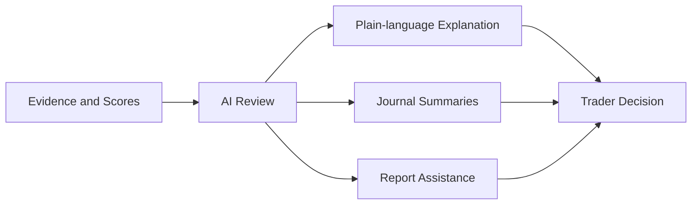

# 08. AI Strategy

## Role of AI
AI will be used to assist traders with research, analysis, and reflection. It should extend the trader's ability to process information without replacing their judgment.

TradeEvidence should position AI as a Decision Coach. Its purpose is to help the trader answer, "What should I be thinking about?" rather than "What should I do?" The system should support reflection, clarify assumptions, and improve decision quality without assuming authority over the trader's judgment.

## Interaction Principles

- Ask before answering.
- Teach before suggesting.
- Present multiple reasonable approaches.
- Explain assumptions.
- Explain risks.
- Respect the Trading Profile.
- Encourage user ownership.
- Never provide individualized investment advice.

## Educational Scenarios

The AI experience should be able to support educational discussion around situations such as:

- down 20% or 50% on a position
- a stock down significantly from highs
- covered calls
- protective puts
- waiting for technical confirmation
- position sizing discussions

## Intended Uses
AI may support:
- explaining scores in plain language
- summarizing evidence and notes
- reviewing journals for patterns and repeated mistakes
- generating structured trading reports
- providing educational assistance
- identifying potential patterns in historical context

## Design Principles
- AI supports trader decisions
- AI does not provide financial advice
- AI outputs should be explainable and reviewable
- AI should surface uncertainty and limitations
- AI should not replace the trader's final decision

## AI Support Flow

## Future Direction
Over time, the platform may expand into more advanced agentic workflows that help users:
- organize research more efficiently
- review previous decisions
- compare assumptions across setups
- prepare summaries for personal review

## Product Positioning
AI features should feel like a thoughtful assistant for disciplined traders, not a black-box oracle or automated advisor.

---

## TODO

### High
- Define the first AI-assisted features to ship in v0.6 and beyond.
- Define acceptable output boundaries and safety constraints for AI-generated assistance.

### Medium
- Clarify how AI-generated explanations should be labeled and reviewed by users.
- Document any content policies or guardrails that should govern AI-assisted summaries.

### Low
- Record any future improvements to AI review flows as the product evolves.

## Related Documents
- [01a-Product-Philosophy.md](01a-Product-Philosophy.md)
- [02-Principles.md](02-Principles.md)
- [03-Architecture.md](03-Architecture.md)
- [07-Decision-Workspace-Concept.md](07-Decision-Workspace-Concept.md)
- [07-Scoring-Engine.md](07-Scoring-Engine.md)
- [09-Data-Model.md](09-Data-Model.md)
- [11-TradeEvidence-Manifesto.md](11-TradeEvidence-Manifesto.md)
- [Trading-Profile.md](Trading-Profile.md)
