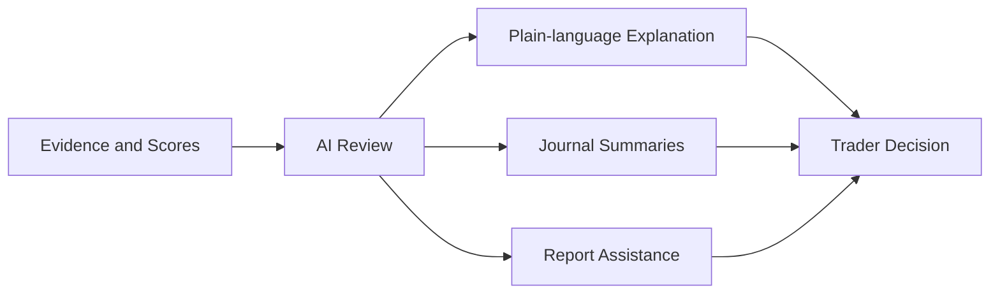

# 08. AI Strategy

## Role of AI
AI will be used to assist traders with research, analysis, and reflection. It should extend the trader's ability to process information without replacing their judgment.

TradeEvidence should position AI as a Decision Coach. Its purpose is to help the trader answer, "What should I be thinking about?" rather than "What should I do?" The system should support reflection, clarify assumptions, and improve decision quality without assuming authority over the trader's judgment.

## Interaction Principles

- Answer directly when grounded context is sufficient; ask one material clarification only when necessary.
- Teach before suggesting.
- Present multiple reasonable approaches.
- Explain explicitly conditional reasoning without inventing assumptions.
- Explain risks.
- Respect only explicitly approved and available Trading Profile context; the MVP excludes profile-based AI personalization.
- Encourage user ownership.
- Never provide individualized investment advice.
- Never fill missing information with invented assumptions.
- Cite approved internal and external sources used.
- Protect proprietary indicator logic, prompts, credentials, and private data.

## Educational Scenarios

The AI experience should be able to support educational discussion around situations such as:

- down 20% or 50% on a position
- a stock down significantly from highs
- covered calls
- protective puts
- waiting for technical confirmation
- position sizing discussions
- timeframe conflicts and missing-information review

## Intended Uses
AI may support:
- explaining scores in plain language
- summarizing evidence and notes
- reviewing journals for patterns and repeated mistakes
- generating structured trading reports
- providing educational assistance
- identifying potential patterns in historical context

## Design Principles
- AI supports trader decisions
- AI does not provide financial advice
- AI outputs should be explainable and reviewable
- AI should surface uncertainty and limitations
- AI should not replace the trader's final decision

## AI Support Flow

```mermaid
flowchart LR
    A[Evidence and Scores] --> B[AI Review]
    B --> C[Plain-language Explanation]
    B --> D[Journal Summaries]
    B --> E[Report Assistance]
    C --> F[Trader Decision]
    D --> F
    E --> F
```

## Future Direction
Over time, the platform may expand into more advanced agentic workflows that help users:
- organize research more efficiently
- review previous decisions
- compare assumptions across setups
- prepare summaries for personal review

## Product Positioning
AI features should feel like a thoughtful assistant for disciplined traders, not a black-box oracle or automated advisor.

## MVP Workflow Boundary

Ask TradeEvidence is a grounded decision-preparation guide governed by the
[AI Workflow Contract](engineering/AI-Workflow-Contract.md). It consumes
published deterministic evidence and approved sources; it never creates or
modifies authoritative evidence.

AI history is Off by default. Users may opt into 1-, 3-, or 7-day retention.
Every response shows Data Status and a material counterpoint. Controlled beta
uses internal and approved pre-ingested external sources; unrestricted live-web
browsing is deferred.

General position-sizing education is permitted, but personalized position-size
recommendations are prohibited.

---

## TODO

### High
- Select providers and models through the approved evaluation and privacy gates.
- Build and human-review the versioned evaluation dataset before controlled beta.

### Medium
- Measure beta usefulness, cost, latency, allowance needs, and source quality.

### Low
- Record any future improvements to AI review flows as the product evolves.

## Related Documents
- [01a-Product-Philosophy.md](01a-Product-Philosophy.md)
- [02-Principles.md](02-Principles.md)
- [03-Architecture.md](03-Architecture.md)
- [07-Decision-Workspace-Concept.md](07-Decision-Workspace-Concept.md)
- [07-Scoring-Engine.md](07-Scoring-Engine.md)
- [09-Data-Model.md](09-Data-Model.md)
- [11-TradeEvidence-Manifesto.md](11-TradeEvidence-Manifesto.md)
- [Trading-Profile.md](Trading-Profile.md)
- [engineering/AI-Workflow-Contract.md](engineering/AI-Workflow-Contract.md)
