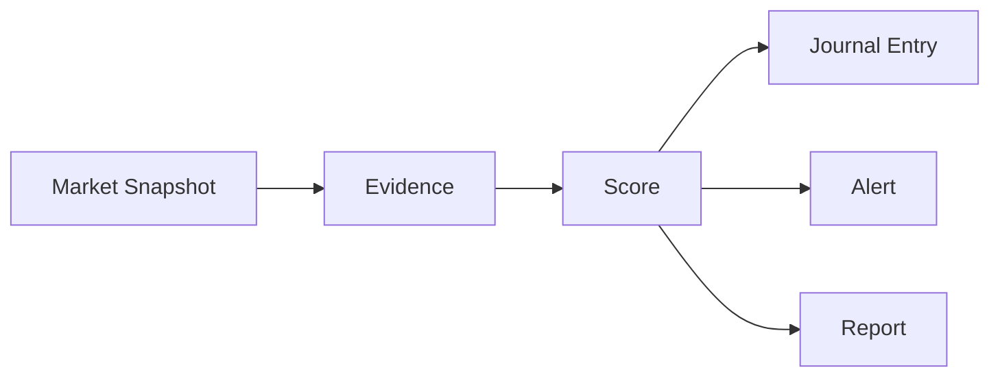
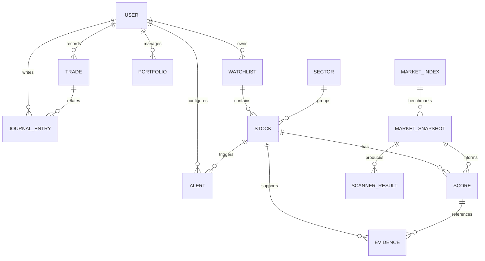

# 09. Data Model

## Overview
This document captures the conceptual data model for TradeEvidence. It is intentionally high level and does not define implementation details.

## Core Entities

| Entity | Description |
| --- | --- |
| User | The trader using the platform. |
| Watchlist | A curated collection of assets or ideas. |
| Stock | A financial instrument or asset tracked in the system. |
| Market Snapshot | A captured view of market conditions at a point in time. |
| Score | A structured evaluation of an asset or setup. |
| Evidence | A supporting piece of information related to a score or thesis. |
| Alert | A notification or trigger tied to a condition of interest. |
| Journal Entry | A personal reflection or record of analysis and outcomes. |
| Trade | A recorded trade event or decision context. |
| Portfolio | A collection of holdings or tracked positions. |
| Sector | A market sector or industry grouping. |
| Market Index | A benchmark or index used for broader context. |
| Scanner Result | An output from a screening or scanning workflow. |

## Relationships
A user may own multiple watchlists, journal entries, and alerts. A watchlist may contain multiple stocks or ideas. A score may be associated with a stock, a market snapshot, and multiple pieces of evidence. Journal entries may reference trades, scores, and market context.

## Score Lifecycle

## Conceptual Model

---

## TODO

### High
- What decision must be made first to unblock the next milestone?
- What user or product risk is most urgent to resolve?
- Which requirement is still ambiguous and needs stakeholder input?

### Medium
- What implementation choice should be clarified before development begins?
- What additional product or UX detail should be defined next?
- Which trade-off should be documented before the feature is prioritized?

### Low
- What future enhancement would benefit from early documentation?
- What minor detail should be captured as the product evolves?
- What open question is useful to keep visible for later refinement?

## Related Documents
- [03-Architecture.md](03-Architecture.md)
- [07-Scoring-Engine.md](07-Scoring-Engine.md)
- [08-AI-Strategy.md](08-AI-Strategy.md)
- [05-Product-Decisions.md](05-Product-Decisions.md)
