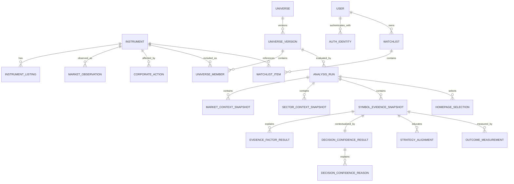

# MVP Data Schema

**Status:** Approved
**Version:** 1.0
**Owner:** Founder and Chief Software Architect
**Approved:** 2026-08-02
**AI-DLC Level:** Level 3 - Controlled

## Purpose

This specification defines the implementation-ready data model for the first TradeEvidence vertical slice. It governs persistence boundaries, entities, identity, lifecycle, lineage, constraints, indexing, versioning, privacy boundaries, and schema acceptance. It does not select a hosting vendor, authentication provider, ORM, or migration framework.

## Plain-Language Model

TradeEvidence preserves accepted analytical runs as immutable files, imports their searchable facts into a PostgreSQL-compatible database, and serves current product views through a transactional publication pointer and disposable caches. Published history is never rewritten. Mutable user research data is kept separate and isolated by owner.

## Persistence and Authority Boundaries

| Plane | Responsibility | Authority |
|---|---|---|
| Immutable object storage | Source files, accepted run bundles, validation reports, reproducibility archive | Analytical system of record |
| PostgreSQL-compatible database | Published run index, snapshots, factors, confidence, selections, outcomes, users, watchlists | Authoritative application read model |
| Cache/CDN | Precomputed current views and common trends | Disposable; never authoritative |
| Git | Code, migrations, schemas, documentation, and sanitized fixtures | Source and specification history; not market-data storage |

Every imported analytical record must be traceable to an immutable run artifact. Provider selection remains deferred.

## Domain Separation

1. **Analytical records:** immutable after publication.
2. **Reference data:** instruments, listings, sectors, benchmarks, universes, and dated memberships.
3. **Application operations:** run validation, publication pointers, and operational metadata.
4. **User data:** internal accounts, provider identity mappings, watchlists, and watchlist items.
5. **Outcome data:** append-only measurements added after the original snapshot.
6. **Future alerts:** versioned definitions plus immutable evaluations/events, followed by mutable delivery and acknowledgement state.

## Identity Rules

- Application entities use opaque, application-generated UUIDv7 identifiers.
- Human-readable values such as ticker, date, or version are not primary keys.
- Instruments keep a stable identity across ticker and exchange changes.
- Every analytical child belongs to exactly one `analysis_run_id`.
- Cross-run analytical relationships are prohibited.
- All timestamps representing an instant use PostgreSQL `timestamptz`.
- Exchange trading dates use `date` and are not inferred from UTC calendar dates.
- Version identifiers are immutable strings or foreign keys to versioned definitions.

## High-Level Relationship Model



## Core Entity Catalog

The column lists below define the required contract. Implementations may add operational columns without weakening these constraints.

### Reference Domain

#### `instruments`

| Column | Type | Rules |
|---|---|---|
| `id` | `uuid` | Primary key, UUIDv7 |
| `instrument_type` | `text` | Constrained enum-like value |
| `legal_name` | `text` | Required |
| `status` | `text` | Active, inactive, delisted, acquired, or unknown |
| `created_at` | `timestamptz` | Required |

#### `instrument_listings`

Stores dated ticker and exchange identity. Required fields: `id`, `instrument_id`, `symbol`, `exchange_code`, `valid_from`, `valid_to`, `source_id`, and `source_version`. Active listings are unique by exchange and symbol. Overlapping validity ranges for the same instrument/listing identity are prohibited.

#### `sectors` and `instrument_sector_memberships`

Sectors have stable IDs and canonical codes. Memberships retain `instrument_id`, `sector_id`, `valid_from`, `valid_to`, classification source, and version. Historical classification is not overwritten.

#### `benchmarks`

Identifies approved context instruments such as SPY, QQQ, IWM, and the 11 Select Sector SPDR representatives. A benchmark references an `instrument_id` and records its analytical role.

#### `corporate_actions`

Required fields include `instrument_id`, action type, effective/ex-dividend date, recorded timestamp, source, source version, adjustment factor or distribution value when applicable, related successor/predecessor instrument, review status, and versioned details.

Phase 1 supports:

- Splits and reverse splits
- Cash dividends
- Stock dividends and material distributions
- Symbol and exchange changes
- Mergers and acquisitions
- Spin-offs
- Delistings

Complex treatments may be marked `requires_review`; they must not be silently converted into zero-return outcomes.

### Universe Domain

#### `universes`

Defines a stable universe concept such as `curated_phase1`.

#### `universe_versions`

Required fields: `universe_id`, semantic version, `as_of`, selection method, eligibility rules JSON, exclusion rules JSON, requested count, and immutable content fingerprint. Each analysis run references one immutable universe version.

#### `universe_members`

Required fields: `universe_version_id`, `instrument_id`, membership status, inclusion/exclusion reason code, and source metadata. `(universe_version_id, instrument_id)` is unique.

### Market-Data Domain

#### `market_data_sources` and `market_data_versions`

Identify the provider or Phase 1 CSV source and the exact imported dataset. Provider credentials are never stored here.

#### `market_observations`

| Column | Type | Rules |
|---|---|---|
| `id` | `uuid` | Primary key |
| `instrument_id` | `uuid` | Required foreign key |
| `market_data_version_id` | `uuid` | Required foreign key |
| `observation_type` | `text` | `eod`, `intraday`, or `realtime` |
| `trading_session` | `text` | `regular`, `premarket`, or `afterhours` |
| `bar_interval` | `text` | Required normalized interval |
| `observation_point` | `text` | Phase 1: `official_close` |
| `market_date` | `date` | Exchange trading date |
| `observed_at` | `timestamptz` | Required |
| `exchange_timezone` | `text` | IANA timezone |
| `open`, `high`, `low`, `close` | `numeric` | Nonnegative; OHLC consistency enforced |
| `volume` | `numeric` | Nonnegative |
| `canonical_price` | `numeric` | Required and nonnegative |
| `adjustment_policy` | `text` | Required |
| `corporate_action_version` | `text` | Nullable only when not applicable |

The uniqueness key includes instrument, observation type, session, interval, observation point, observed timestamp, source, and data version. Provider corrections create new versioned observations rather than overwriting values used by published snapshots.

Phase 1 comparison basis is exactly:

```text
eod + regular + 1d + official_close
```

Queries must reject or require explicit approved normalization when observation type, session, interval, observation point, or adjustment basis differs.

### Analytical-Run Domain

#### `analysis_runs`

Required columns include:

```text
id uuid primary key
status text
universe_version_id uuid
snapshot_type text
market_data_as_of timestamptz
generated_at timestamptz
staged_at timestamptz null
validated_at timestamptz null
approved_at timestamptz null
approved_by uuid null
published_at timestamptz null
superseded_at timestamptz null
superseded_by_run_id uuid null
engine_version text
ruleset_version text
decision_confidence_model_version text
selection_model_version text
strategy_alignment_version text
payload_schema_version text
bundle_checksum text
analytical_fingerprint text
equivalent_run_id uuid null
failure_stage text null
failure_category text null
```

Allowed lifecycle:

```text
generated -> staged -> validated -> approved -> published -> superseded
                           \-> rejected
```

`redundant` records an execution whose normalized analytical fingerprint matches an existing accepted candidate or published run. Rejected or redundant runs cannot become current without a new valid lifecycle.

#### `analysis_run_artifacts`

Stores artifact type, immutable object key, SHA-256 checksum, record count, media type, schema version, and import timestamp. Secrets and unnecessary local paths are prohibited.

#### `analysis_run_validations`

Stores validation code, severity, status, entity reference, structured details, rendered message, validator version, and timestamp. Validation history is append-only after approval.

#### `publication_pointers`

| Column | Type | Rules |
|---|---|---|
| `channel` | `text` | Primary key; example `production_eod` |
| `current_analysis_run_id` | `uuid` | References one published run |
| `updated_at` | `timestamptz` | Required |
| `updated_by` | `uuid` | Required human or service identity |

Publication changes this pointer in one transaction after rechecking approval and completeness. The website never infers current data from the newest timestamp.

### Analytical-Snapshot Domain

#### `market_context_snapshots`

One or more versioned market-context records per run. Stores regime, risk environment, freshness, supporting/contradicting summaries, observation references, and rendered publication-time explanation.

#### `sector_context_snapshots`

Unique by run and sector. Stores representative benchmark, trend, momentum, relative strength, evidence state, freshness, observation references, factors, and publication-time explanation.

#### `symbol_evidence_snapshots`

| Column | Type | Rules |
|---|---|---|
| `id` | `uuid` | Primary key |
| `analysis_run_id` | `uuid` | Required foreign key |
| `instrument_id` | `uuid` | Required foreign key |
| `symbol_at_publication` | `text` | Required historical display value |
| `market_observation_id` | `uuid` | Exact observation used |
| `market_context_snapshot_id` | `uuid` | Same run required |
| `sector_context_snapshot_id` | `uuid` | Same run required when available |
| `snapshot_type`, `session`, `bar_interval` | `text` | Required comparison identity |
| `market_data_as_of` | `timestamptz` | Required |
| `canonical_price` | `numeric` | Exact publication-time anchor |
| `technical_evidence_score` | `numeric(5,2)` | 0 through 100 when complete |
| `evidence_band` | `text` | Must agree with approved band ranges |
| `evidence_status` | `text` | Complete or incomplete |
| `coverage_percent` | `numeric(5,2)` | 0 through 100 |
| `freshness_status` | `text` | Current, stale, or superseded |

Uniqueness: `(analysis_run_id, instrument_id, snapshot_type)`. An incomplete snapshot cannot receive a Homepage selection.

#### `evidence_factor_results`

Stores snapshot ID, factor code, factor-definition version, observed state, effect (`supporting`, `contradicting`, `neutral`, `unavailable`, or `not_evaluated`), contribution, explanation code, template version, structured parameters, rendered publication-time text, and display order. Factor code is unique within a snapshot and ruleset.

#### `decision_confidence_results` and `decision_confidence_reasons`

Each Phase 1 symbol snapshot has one categorical result for its model version: Strong, Moderate, Constrained, or Incomplete. Reasons store supporting, constraining, and unavailable categories, reason codes, observed values, materiality, structured parameters, and exact rendered text. Decision Confidence is not probability, prediction, recommendation, or personalized suitability.

#### `strategy_alignments`

Stores educational strategy code, alignment state, logic version, principal reasons, missing information, risk classification, and publication-time explanation. It does not store a personalized strategy selection or trade construction.

#### `deterministic_explanations`

Stores stable explanation code, template version, parameters JSON, and exact rendered text. This permits future wording changes without rewriting what users historically saw.

#### `homepage_selections`

Stores analysis run, symbol snapshot, rank, selection-model version, principal support and constraint codes, and rendered card explanation. Rank and symbol snapshot are unique within a run. Selection requires complete, current, eligible evidence and non-Incomplete Decision Confidence.

### Outcome Domain

#### `outcome_measurement_definitions`

Versioned definitions specify trading-session horizon, anchor basis, return method, benchmark, corporate-action treatment, missing-data policy, and calculation version.

#### `outcome_measurements`

Stores source snapshot, definition, revision number, lifecycle state, anchor and target observation IDs, benchmark observations, calculated values, data version, calculated timestamp, correction reason, and superseded measurement reference.

Lifecycle:

```text
pending -> eligible -> measured
                    -> unavailable | censored | requires_review
```

Corrections append a new revision and preserve the earlier result. Missing or interrupted outcomes are never treated as zero. Outcome records alone do not establish predictive validity.

### User Research Domain

#### `users`

Stores the stable internal user ID, account status, and lifecycle timestamps. Email is not the permanent ownership key.

#### `auth_identities`

Maps an internal user to an external authentication provider through unique `(provider, provider_subject)`. It may retain email at link time and authentication timestamps. Passwords, provider credentials, and authentication secrets are prohibited.

#### `watchlists`

Stores owner `user_id`, name, optional description, and timestamps. Phase 1 watchlists are private and single-owner.

#### `watchlist_items`

Stores watchlist, stable instrument, optional source symbol snapshot, mutable user note, and timestamps. `(watchlist_id, instrument_id)` is unique. Current analytical summaries come from the current published run; the optional source snapshot preserves why the item was added.

## User Isolation and Privileged Access

Private data is deny-by-default:

- Every private record has an explicit internal owner.
- Requests and queries are scoped to the authenticated internal `user_id`.
- Application authorization is mandatory; database row-level security should provide defense in depth where supported.
- APIs do not accept an arbitrary user ID as authority.
- Private cache keys and object access include ownership scope.
- Cross-user read, mutation, export, and deletion attempts must be tested and denied.

Normal users and normal staff roles cannot access another user's private information. Exceptional staff access must be least-privileged, purpose-specific, explicitly authorized, time-bounded where practical, revocable, and fully audited. Audit records include staff identity, role, target user, approved scope, reason, ticket/incident, approver, start/expiry, and actions. Infrastructure-level access is separately restricted and monitored.

## Relational and JSON Boundary

Typed relational columns and child tables hold identity, timestamps, versions, scores, states, common filters, contributions, reasons, selections, outcomes, and lineage. Versioned JSON is limited to bounded provider metadata, corporate-action details, diagnostics, explanation parameters, and validation context.

Core searchable facts may not exist only in JSON. JSON must conform to a supported schema version. Deterministic explanations retain both structured provenance and exact rendered text.

## Import Idempotency and Analytical Fingerprints

Every execution receives a unique run ID.

- Run ID plus bundle checksum protects exact retries and bundle integrity.
- A normalized analytical fingerprint excludes volatile metadata such as run ID, generated timestamp, local filenames, and import timestamp.
- An identical fingerprint across run IDs marks the later execution `redundant`; it does not duplicate published snapshots.
- Any meaningful change to source data, scores, confidence, selections, versions, or displayed explanations creates a new candidate requiring validation and approval.
- Reuse of a run ID with different content is rejected as an identity conflict.

Import flow:

```text
receive -> verify -> stage -> import -> reconcile -> validate -> approve -> publish
                                                    \-> reject/redundant
```

Staged data remains invisible to normal product queries. Failure records its stage and category, leaves the current pointer unchanged, and does not invalidate caches. Cache refresh occurs after the database publication transaction and can be retried independently.

## Immutability and Deletion

After publication, run identity, versions, artifacts, snapshots, factors, confidence, strategy alignment, explanations, Homepage selections, referenced observations, and publication-time checksums are immutable. Corrections require a new run.

Outcome revisions and validation annotations may be appended. Watchlist items and notes remain mutable by their owner. Published analytical records cannot be hard-deleted through normal application operations. Reference data used by history is protected by foreign keys. Personal-data deletion, export, and retention periods are finalized in the security and privacy specification before production.

## Database-Enforced Constraints

At minimum, migrations and tests enforce:

- Scores and coverage remain between 0 and 100.
- Evidence band agrees with the approved score range.
- Missing required evidence produces Incomplete status.
- Incomplete results cannot appear in Homepage selections.
- Homepage rank is unique within a run.
- Factor codes are unique within snapshot and ruleset.
- Market, sector, and symbol snapshot relationships share one run.
- One current publication pointer exists per channel.
- Only approved, complete runs can become current.
- Rejected and redundant runs cannot become current.
- OHLCV values are nonnegative and internally consistent.
- Outcome definition and revision uniqueness is enforced.
- Watchlist ownership and item uniqueness are enforced.
- Historical records cannot be orphaned by reference deletion.

Cross-record rules such as the maximum of two Homepage selections per sector require transactional validation when they cannot be expressed safely as a simple constraint.

## Required Query Paths and Indexes

Indexes must support:

1. Current publication resolution
2. Today's Briefing and market context
3. Homepage selections in rank order
4. One symbol's Decision Workspace
5. Compact symbol score/confidence history
6. User watchlists and current symbol summaries
7. Outcome append and retrieval
8. Run audit and reproduction

Representative indexes:

```text
publication_pointers(channel)
analysis_runs(status, published_at)
analysis_runs(analytical_fingerprint)
symbol_evidence_snapshots(analysis_run_id, instrument_id)
symbol_evidence_snapshots(instrument_id, market_data_as_of desc)
sector_context_snapshots(analysis_run_id, sector_id)
homepage_selections(analysis_run_id, rank)
evidence_factor_results(symbol_snapshot_id, display_order)
decision_confidence_reasons(decision_confidence_result_id, reason_type)
market_observations(instrument_id, observation_type, trading_session, bar_interval, market_date desc)
outcome_measurements(symbol_snapshot_id, measurement_definition_id, revision_number)
watchlists(user_id, updated_at desc)
watchlist_items(watchlist_id, instrument_id)
auth_identities(provider, provider_subject)
```

Historical pagination uses stable cursors such as `(market_data_as_of, snapshot_id)`. Database partitioning is deferred until measured scale requires it. Current-view denormalization is allowed only for immutable publication-time summaries and never for request-time analytical recalculation.

## Versioning and Migration Policy

The following evolve independently:

- Engine
- Scoring ruleset
- Decision Confidence model
- Homepage selection model
- Strategy Alignment logic
- Payload schema
- Database schema
- Explanation templates
- Universe
- Market data
- Outcome definitions
- AI workflow

Imports reject unsupported payload versions rather than guessing. Compatible additive changes may remain within a major version; breaking changes require a new major version and explicit adapter or migration.

Database changes use ordered, source-controlled migrations. Destructive migrations require preservation and rollback plans. New required fields require safe backfill or an explicit historical unknown state. Schema changes do not recalculate historical analytical values. The migration framework is selected with backend architecture.

## Deferred Physical Entities

Do not create speculative production tables yet for:

- Portfolios, holdings, or trades
- Journal entries or Decision Snapshots
- Persistent AI conversations
- Brokerage accounts
- User-configured alert rules, alert events, or delivery attempts

Alert lineage remains approved conceptually but awaits its product workflow. Authentication provider, database host, object-storage vendor, ORM, migration framework, API payloads, backend boundaries, final scoring weights, AI provider, personal-data retention periods, and release authorization remain deferred.

## Implementation Acceptance Criteria

1. Source-controlled migrations create a clean database from zero.
2. Migrations are repeatable in development and test.
3. Foreign keys reject mixed-run and orphaned records.
4. Exact retries create no duplicates.
5. Semantic duplicate runs are detected by analytical fingerprint.
6. Failed imports cannot change the publication pointer.
7. Published analytical records cannot be changed through normal operations.
8. Cross-user access is denied and privileged access is scoped and audited.
9. Score, band, coverage, observation, and uniqueness constraints are tested.
10. Unlike observation bases cannot be silently compared.
11. Outcome corrections preserve prior revisions.
12. Common query plans are reviewed against representative data.
13. Sanitized fixtures cover current, stale, incomplete, rejected, redundant, corrected, and corporate-action review states.
14. Backup and restore behavior is tested before production release.

## Risks and Human Approval Boundaries

- Current scoring weights remain unvalidated hypotheses.
- Market-data licensing must permit storage, derived use, display, and redistribution.
- Cross-run consistency and user isolation are Level 3 controls requiring human-reviewed tests.
- Complex corporate actions may require manual review.
- Performance targets require representative load measurement.
- Human approval remains required for scoring methodology, security exceptions, production publication during Phase 1, vendor commitments, destructive migrations, material retention changes, and releases.

## Related Documents

- [MVP Implementation Specification](MVP-Implementation-Spec.md)
- [Master System Architecture](Master-System-Architecture.md)
- [Canonical Analytical Model](Canonical-Analytical-Model.md)
- [Market Data Strategy](Market-Data-Strategy.md)
- [ADR-004](../governance/decisions/ADR-004-Canonical-Market-Observations-and-Retention.md)
- [ADR-005](../governance/decisions/ADR-005-MVP-Persistence-and-Data-Integrity.md)
- [Workshop #3 Summary](../workshops/Workshop-03-Summary.md)
